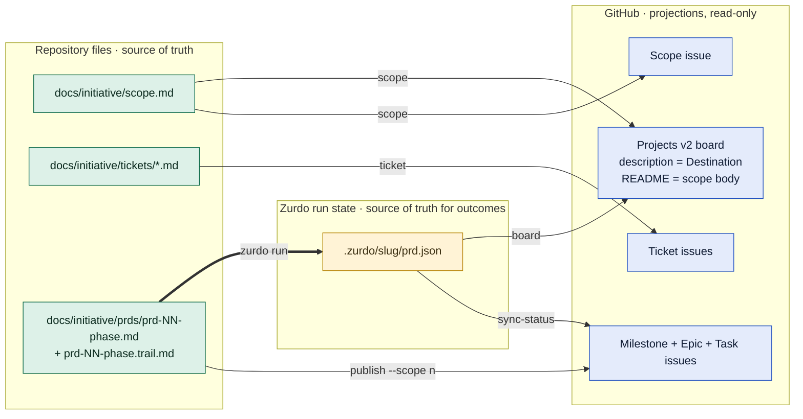
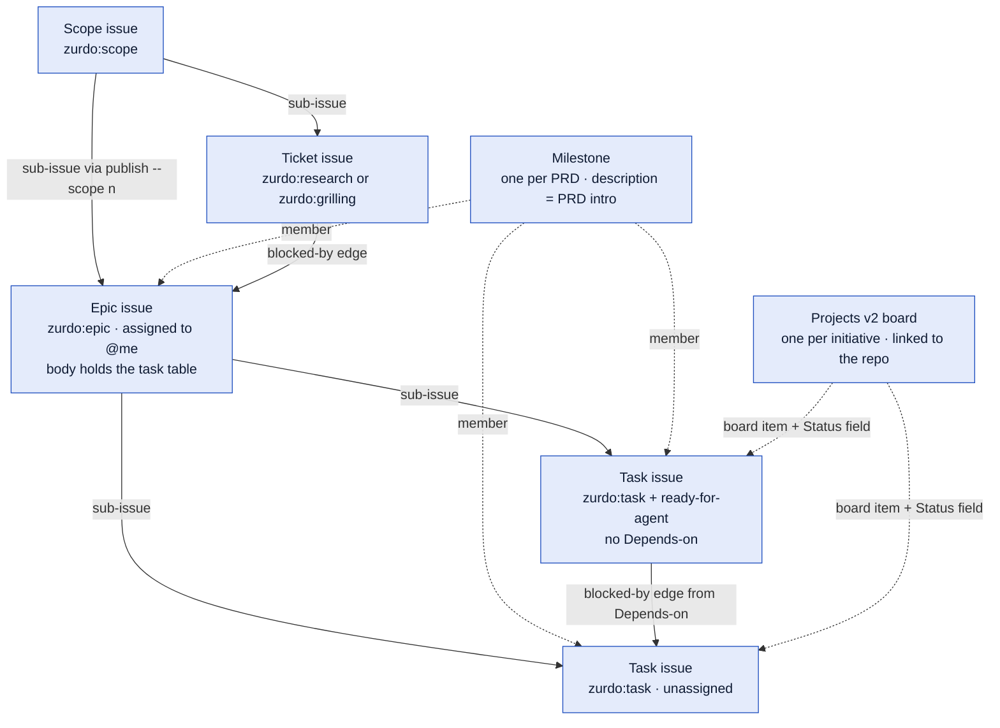
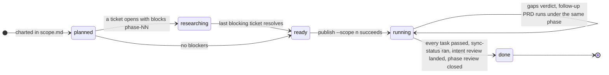
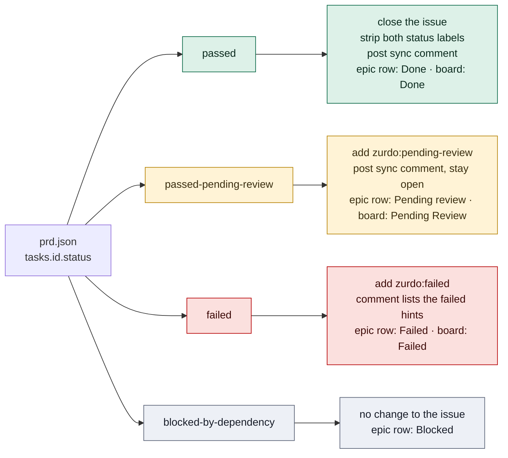
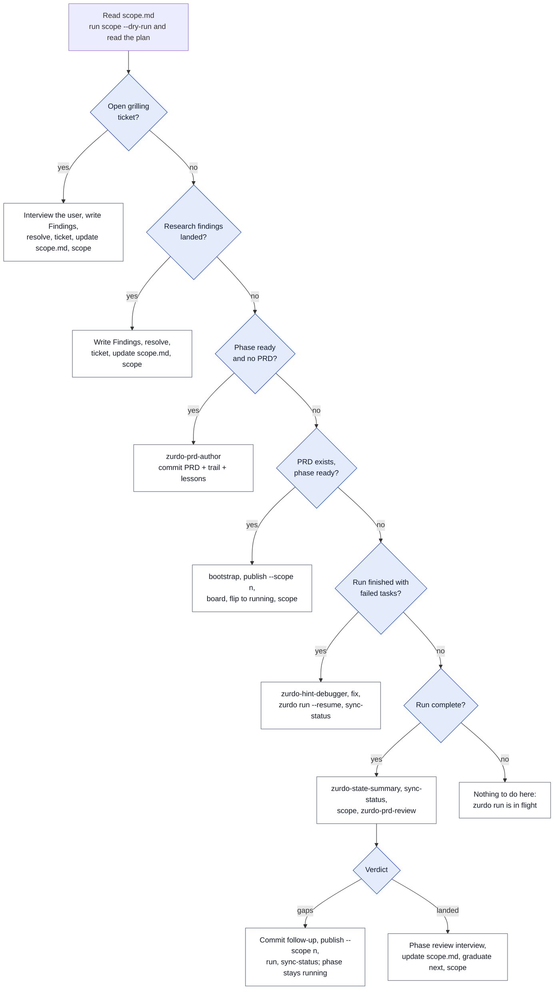
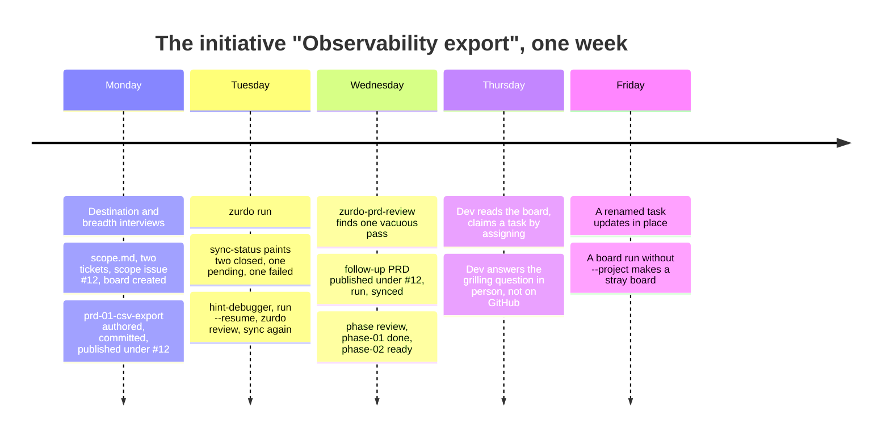

# Zurdo GitHub Journey

How `zurdo-project`, `zurdo-github`, and the `zurdo` CLI work together so that GitHub always shows the true state of an initiative without ever becoming the place where that state lives.

| Skill | Role |
|---|---|
| `zurdo-project` | The conductor. Scopes an initiative into phases, opens research and grilling tickets, decides what the next session does, and runs the phase review. Owns `scope.md`. |
| `zurdo-github` | The projector. One shell script with six modes that paints files onto GitHub as issues, milestones, labels, and a Projects v2 board. Never writes back. |
| `zurdo` | The engine. Runs a PRD task by task, gates each on acceptance criteria, and records everything in `.zurdo/<slug>/prd.json`. |

Stations:

0. [The model](#00-the-model-files-are-truth-github-is-a-projection)
1. [Chart](#01-chart-the-initiative)
2. [Research](#02-research-and-grilling-tickets)
3. [Author](#03-author-the-phase-prd)
4. [Publish](#04-publish-the-phase-to-github)
5. [Run and sync](#05-run-zurdo-and-sync-status-back)
6. [Review and loop](#06-phase-review-and-the-loop-back)
7. [Any later session](#07-any-later-session-orient-then-pick-one-action)
8. [Command cards](#08-command-cards)
9. [This repo](#09-where-perro-skills-stands-today)
10. [One week, in stories](#10-one-week-in-stories)

---

## 00 · The model: files are truth, GitHub is a projection

Every rule in both skills follows from one idea. Three sets of files in the repository hold the state. GitHub is a rendering of those files that anyone can read from a browser, filter by label, or pick work from. Edits flow in one direction only.



Every edge label is a `zurdo-github.sh` mode except the thick one, which is the Zurdo CLI itself. No arrow ever points from the GitHub column back to the left.

> **The one rule.** Change a file, then re-run the projection. Never patch an issue body, a Project description, a README, or a label by hand and expect it to stick. The next run overwrites it.

### How GitHub objects nest

One initiative is one Projects v2 board and one scope issue. One phase is one PRD, which becomes one milestone and one epic. Tasks hang under the epic. Tickets hang under the scope issue and block the epics of the phases they gate.



Solid edges are structural sub-issue or dependency links. Dotted edges are membership. When a GitHub plan lacks sub-issues or the dependency graph, the script degrades to a checklist in the epic body and a `Blocked by:` line, and prints which mode ran.

### Identity is a hidden marker, not a title

Each issue the script creates carries an HTML comment in its body. Re-runs search for the marker, confirm it with an exact substring match, and update in place. A renamed task still resolves to the same issue, so there are no ghost duplicates.

```
<!-- zurdo-github scope=<initiative-slug> -->
<!-- zurdo-github scope=<initiative-slug> ticket=<name> -->
<!-- zurdo-github prd=<path> epic -->
<!-- zurdo-github prd=<path> task=<task-id> -->
```

### The label vocabulary

Labels are created idempotently with these exact colors. Type labels say what an issue is. Status labels are swapped, never stacked. Effort labels mirror whatever `Effort` values the PRD uses.

| Group | Label | Color |
|---|---|---|
| type | `zurdo:scope` | `#0052CC` |
| type | `zurdo:research` | `#006B75` |
| type | `zurdo:grilling` | `#EE0701` |
| type | `zurdo:epic` | `#5319E7` |
| type | `zurdo:task` | `#1D76DB` |
| state | `zurdo:pending-review` | `#FBCA04` |
| state | `zurdo:failed` | `#B60205` |
| effort | `effort:<value>` | `#BFD4F2` |
| triage | `needs-triage` | `#C5DEF5` |
| triage | `needs-info` | `#CCCCCC` |
| triage | `ready-for-agent` | `#0E8A16` |
| triage | `ready-for-human` | `#D4C5F9` |
| triage | `wontfix` | `#FFFFFF` |

---

## 01 · Chart the initiative

**Skill:** `zurdo-project`. **Output:** `docs/<initiative>/scope.md`, a scope issue, and a Project board whose front page reads like the scope file.

The first session runs two interviews. The destination interview ends when "done" fits in one or two sentences seen from the outside. The breadth interview names the major phases and sorts everything else into a sharp ticket or fog. Nothing is written to disk until the destination is locked.

### What lands in scope.md

| Section | Holds | Projected to |
|---|---|---|
| Destination | What done looks like, from outside | Scope issue body; Project description (first paragraph, 256 chars) |
| Notes | Domain facts, standing preferences, skills to consult | Scope issue; Project README |
| Decisions so far | One line per resolved ticket, linking the ticket file | Scope issue; Project README |
| Phases | Table: phase id, title, PRD path, status | Scope issue, re-rendered with epic and milestone links |
| Not yet specified | Fog. Questions not yet sharp enough to ticket | Scope issue; Project README |
| Out of scope | Exclusions with a one-line reason each | Scope issue; Project README |

> **Fog or ticket.** Can the question be stated precisely right now, not answered, just stated? Yes: open a ticket. No: leave it in Not yet specified. Never pre-slice fog into guessed sub-tickets.

### Commands for this station

```bash
# the path argument is the scope file itself
zurdo-github.sh scope --dry-run docs/<initiative>/scope.md
zurdo-github.sh scope           docs/<initiative>/scope.md
```

A live `scope` run creates or updates the scope issue, creates the Projects v2 board if missing, links it to the repository so it shows under the Projects tab, and rewrites the board's description and README from the file. Re-run it after every edit to `scope.md`.

---

## 02 · Research and grilling tickets

**Skill:** `zurdo-project`. **Output:** ticket files under `docs/<initiative>/tickets/`, each projected as a sub-issue of the scope issue.

Two ticket types share one file format but differ in who resolves them.

| | Research | Grilling |
|---|---|---|
| Resolved by | A subagent, unattended | The user, in a live interview |
| Agent may answer it | Yes, with cited findings | Never. It asks, waits, records verbatim |
| Parallelism | All open tickets at once | One per session |
| Claim | Assign yourself on the issue before touching the file | Same |

A ticket with `blocks: [phase-NN]` holds that phase in `researching`. No PRD is written for a phase while any of its blocking tickets is open. When the ticket resolves, the phase PRD's Background section links the ticket file so the decision stays traceable.

### Resolving a ticket, in order

1. Write `## Findings` in the ticket file. For grilling tickets, record the user's answer verbatim.
2. Flip `status: resolved` in the frontmatter.
3. Run `ticket` so the findings post as a comment and the issue closes.
4. Update `scope.md`: add a Decisions line or graduate the fog item, then re-run `scope`.

```bash
# the path argument is the ticket file; scope.md must live in the parent directory
zurdo-github.sh ticket --dry-run docs/<initiative>/tickets/<name>.md
zurdo-github.sh ticket           docs/<initiative>/tickets/<name>.md
```

The `ticket` mode exits 3 with "run scope first" if the scope issue does not exist yet. It projects one file and links it under the scope issue. The blocked-by edges from phase epics to tickets are wired by the `scope` sweep, and only once the epic exists; until the phase is published, `scope` prints `defer: phase-NN has no epic yet` and retries on its next run. `scope` also projects every ticket file, so a first session needs no `ticket` call at all.

---

## 03 · Author the phase PRD

**Skill:** `zurdo-prd-author`, invoked by `zurdo-project`. **Output:** a PRD, its `.trail.md` sidecar, and possibly `lessons/` files, in one commit.

The phase must be `ready`: no open blocking tickets. The author interview grills intent into tasks, dependency edges, and acceptance criteria whose hints actually verify. It stops only on `✓ READY TO RUN`. A phase that has to choose between approaches on evidence gets a design record first from `zurdo-design-author`.

The commit is the human review gate. Publish reads the PRD, and the later intent review reads the trail. Both should be in git before GitHub sees anything.

```bash
zurdo validate docs/<initiative>/prds/prd-01-<phase>.md   # must exit 0
git add docs/<initiative>/prds/prd-01-<phase>.md \
        docs/<initiative>/prds/prd-01-<phase>.trail.md lessons/
git commit -m "prd: phase 01 <phase>"
```



Phase status as tracked in the Phases table of `scope.md`. Only one phase is `running` at a time. The milestone and epic for a phase exist on GitHub only after its PRD is published, never as placeholders.

---

## 04 · Publish the phase to GitHub

**Skill:** `zurdo-github`. **Output:** a milestone, an epic nested under the scope issue, one task issue per PRD task, dependency edges, and board membership.

Publishing is a two-pass write. Pass one creates every issue. Pass two wires sub-issue and blocked-by edges using database ids, which survive renames, unlike issue numbers.

```bash
# once per repo, idempotent: labels, optional About, conventions doc
zurdo-github.sh bootstrap --dry-run docs/<initiative>/prds/prd-01-<phase>.md
zurdo-github.sh bootstrap           docs/<initiative>/prds/prd-01-<phase>.md

# the phase, nested under scope issue #n
zurdo-github.sh publish --dry-run --scope <n> docs/<initiative>/prds/prd-01-<phase>.md
zurdo-github.sh publish           --scope <n> docs/<initiative>/prds/prd-01-<phase>.md

# optional, last, needs the project scope on gh auth
zurdo-github.sh board --project "<initiative title>" --dry-run docs/<initiative>/prds/prd-01-<phase>.md
zurdo-github.sh board --project "<initiative title>"           docs/<initiative>/prds/prd-01-<phase>.md

# scope.md: flip the phase row to running, then refresh the projection
zurdo-github.sh scope --dry-run docs/<initiative>/scope.md
zurdo-github.sh scope           docs/<initiative>/scope.md
```

### What to check in the dry-run plan

- **Repo line.** The first block prints `repo: owner/name`. It is parsed from the origin remote, never from a network call.
- **Task count.** The number of create-issue lines equals the number of task blocks in the PRD. A miss means a malformed task header was skipped.
- **Every Depends-on is an edge.** Each dependency produces a wire line. A missing one means a misspelled task id.
- **No surprise labels.** An unexpected `effort:` value is a typo in the PRD, and labels created live are never auto-removed.

> **Pass `--project` on `board`.** Without it, `board` defaults the project title to the PRD title and would create a second board. Pass the initiative title that `scope` used so tasks land on the same board.

### Re-running publish after editing the PRD

Safe. Titles, bodies, effort labels, milestone membership, and new edges update in place. Closed issues stay closed. Assignees and comments are preserved. A task removed from the PRD is reported as an orphan for you to close by hand.

---

## 05 · Run Zurdo and sync status back

**Tools:** `zurdo run`, then `zurdo-state-summary`, `zurdo-hint-debugger`, and `zurdo-github sync-status`.

Zurdo writes every outcome to `.zurdo/<slug>/prd.json`, where the slug is the PRD basename plus a content hash. Sync reads that one file and applies a fixed mapping to GitHub. It never reads GitHub state, the scope issue, or any ticket.



One sync comment per task per run, with attempts, model, tokens, and estimated cost drawn from the last iteration. A task at `attempts: 0` passed without an agent run and the comment says so.

```bash
zurdo run

# confirm the run is settled first: no live lock, no in-flight iteration
# (invoke zurdo-state-summary, or read prd.json by hand)

zurdo-github.sh sync-status --dry-run docs/<initiative>/prds/prd-01-<phase>.md
zurdo-github.sh sync-status           docs/<initiative>/prds/prd-01-<phase>.md

# sign off [manual] criteria in the TUI, then sync again so pending tasks close
zurdo review
zurdo-github.sh sync-status docs/<initiative>/prds/prd-01-<phase>.md

zurdo-github.sh scope docs/<initiative>/scope.md
```

Sync picks the newest run directory matching the PRD basename. Pass `--slug` to pin a specific one. If a task failed, invoke `zurdo-hint-debugger` on the criterion before touching the hint or the code, fix, then `zurdo run --resume` and sync again so GitHub shows the failure while you work.

> **Divergence.** If a human closed a task issue by hand, sync leaves it closed and prints a `DIVERGED` line. It never reopens, never deletes, never stacks a second status label.

---

## 06 · Phase review and the loop back

**Skills:** `zurdo-prd-review`, then the `zurdo-project` review interview.

Green criteria are necessary, not sufficient. A hint can pass on a diff that misses the point. So the review starts by binding `run-diff.patch` to each task's intent, using the trail as the best intent source, and ends in one of two verdicts.

- **Landed as intended.** Proceed to the three-round interview: outcomes vs plan, sharpened knowledge, scope changes.
- **Gaps exist.** A follow-up PRD is scaffolded beside the original. Commit it, publish it with the same `--scope n`, run it, sync it. The phase stays `running` until the follow-up is green. No interview yet.

After the interview, edit `scope.md` in this order: Decisions so far, the Phases table (flip to `done`, graduate the next `ready` phase), Out of scope, Not yet specified. Then re-run `scope`. The review ends when either the next phase is named or the destination is reached and the scope issue is closed.

```mermaid
sequenceDiagram
  autonumber
  actor You
  participant Agent
  participant Files as Repo files
  participant Script as zurdo-github.sh
  participant GH as GitHub
  participant Zurdo as zurdo CLI

  You->>Agent: an idea
  Agent->>You: destination and breadth interview
  Agent->>Files: write scope.md and tickets/*.md
  Agent->>Script: scope (dry-run, then live)
  Script->>GH: scope issue, ticket issues under it, Project board, description and README
  Note over You,Files: zurdo-prd-author interview ends on READY TO RUN; commit PRD + trail + lessons
  Agent->>Script: publish --scope n (dry-run, then live)
  Script->>GH: milestone, epic under scope, task issues, edges
  Agent->>Script: board --project "title"
  Script->>GH: enroll tasks, set Status
  Agent->>Files: flip phase to running in scope.md
  Agent->>Script: scope
  Agent->>Zurdo: zurdo run
  Zurdo->>Files: .zurdo/slug/prd.json
  Agent->>Script: sync-status (dry-run, then live)
  Script->>GH: close passed, label pending or failed, comment, refresh epic table
  You->>Zurdo: zurdo review signs off [manual] criteria
  Agent->>Script: sync-status again
  Note over Agent,Files: zurdo-prd-review binds run-diff.patch to each task's intent
  alt gaps exist
    Agent->>Files: commit follow-up PRD
    Agent->>Script: publish --scope n, then zurdo run, then sync-status
  else landed as intended
    Agent->>You: phase review interview, three rounds
    Agent->>Files: update scope.md: decisions, phase done, next phase ready
    Agent->>Script: scope
  end
```

One full phase, end to end. Every write to GitHub passes through the script, and every script call is preceded by a dry run whose plan gets read.

---

## 07 · Any later session: orient, then pick one action

Every session after the first starts the same way. Read `scope.md`. Run `scope --dry-run` and read the plan for divergence. Then take the first action in this priority order that applies.



The priority table from the `zurdo-project` runbook, drawn as a decision tree. Grilling first because it is the only branch that needs you present.

---

## 08 · Command cards

One script, six modes, one shape. The last argument is a path, and which file you pass depends on the mode. Every mode accepts `--dry-run` and `--repo owner/name`.

| Mode | Path argument | Invocation |
|---|---|---|
| `bootstrap` | Any PRD. Once per repo, idempotent. | `zurdo-github.sh bootstrap [--about "one-liner"] <prd>` |
| `scope` | `scope.md`. Slug is its directory name. Also creates and links the board, writes description and README. | `zurdo-github.sh scope [--project "title"] docs/<init>/scope.md` |
| `ticket` | One ticket file under `tickets/` beside `scope.md`. Needs the scope issue to exist. | `zurdo-github.sh ticket docs/<init>/tickets/<name>.md` |
| `publish` | The phase PRD. With `--scope n` the epic nests under the scope issue. | `zurdo-github.sh publish --scope <n> docs/<init>/prds/prd-NN-<phase>.md` |
| `sync-status` | The phase PRD. Reads the newest `.zurdo` run for that basename, or `--slug`. | `zurdo-github.sh sync-status [--slug <slug>] docs/<init>/prds/prd-NN-<phase>.md` |
| `board` | The phase PRD. Needs the `project` scope on `gh auth`. Pass the initiative title. | `zurdo-github.sh board --project "<initiative title>" docs/<init>/prds/prd-NN-<phase>.md` |

### Preconditions

```bash
gh auth status              # Token scopes must include repo; project for board
gh auth refresh -s project  # only if board is wanted
jq --version                # the script parses every gh api response with jq
zurdo skills install --all  # zurdo-prd-author, zurdo-domain, zurdo-lessons are required
```

### What the script touches, and what it never touches

| Target | Rule |
|---|---|
| Milestone description | Overwritten on every run |
| Project description and README | Overwritten on every `scope` run; `board` leaves them alone |
| Repo About | Written only when empty and `--about` is passed |
| Repo README | Never |
| Task assignees | Never set, never cleared. Assignment is how a contributor claims a task |
| Epic assignee | Set to `@me` at publish |
| Closed issues | Never reopened. Body and labels still update |
| Labels, milestones, issues | Never deleted. Orphans are reported for a human to close |

### Reading exit codes

The script itself documents: 0 ok, 2 usage or PRD parse error, 3 auth or capability error, 1 anything else. Exit 3 comes with a hint, such as "run scope first" or the `gh auth refresh -s project` command.

> **Reconciled on 12 September 2026.** Both runbooks now carry the script's exit-code table, every reference uses `planned → researching → ready → running → done`, and every command in the `zurdo-project` references carries its path argument. If a doc and the script disagree again, trust the script.

---

## 09 · Where perro-skills stands today

This repository built its three skills PRD-first, without the initiative layer. There is no `scope.md` and no `tickets/` directory. PRDs live at `docs/<skill>/prds/`, and three run directories sit under `.zurdo/`.

Two ways to bring GitHub state to it:

- **PRD-only.** Run `bootstrap`, then `publish` without `--scope` for each existing PRD, then `sync-status` against its run. You get milestones, epics, and task issues with history, but no scope issue or board front page.
- **Full initiative.** Write `docs/perro-skills/scope.md` with the catalog as the destination and one phase row per skill, run `scope`, then `publish --scope n` for each PRD. Existing PRDs would need to move or be linked from the phase rows, because `ticket` and `scope` derive the slug from the scope file's directory.

Either way the first command is a dry run, and the first thing to read in its output is the `repo:` line.

---

## 10 · One week, in stories

The same mechanics, told as a week on a small team. Mara is the developer who owns the initiative. Dev is a teammate who has never run Zurdo and only ever looks at GitHub. The initiative is the one from the skill's own examples: a CLI that exports observability data to CSV and posts it to a webhook.



What GitHub shows at the end of each day is a consequence of which files changed and which script mode ran afterwards.

### Monday: an idea becomes a board

Mara opens a session with one sentence: "I want a CLI that exports our monitoring data to CSV and posts it to a webhook." The agent recognizes an initiative, not a PRD, so `zurdo-project` takes the wheel. It asks what done looks like from the outside, offers a recommended answer, and keeps going until the destination fits in two sentences. Then the breadth interview: what are the big pieces, and what do you already know you do not know?

Mara names two pieces. The CSV export is clear. Webhook delivery is not, because nobody knows what retry policy the receiving endpoints expect, and nobody has decided how the webhook authenticates. The agent sorts these without asking permission: one phase that is `ready`, one phase that is `researching`, one research ticket about retries that a subagent can answer alone, and one grilling ticket about auth that only Mara can answer. It writes `docs/observability-export/scope.md` and the two ticket files.

Now the first GitHub write. The agent runs `scope --dry-run` and reads the plan aloud: the repo line, the initiative title, the two phase rows, and the payload that will become the Project's description and README. Mara nods. The live run creates scope issue #12, sweeps the two ticket files so #13 and #14 appear as sub-issues under #12, creates a Projects v2 board named after the initiative, links it to the repo, and writes the Destination paragraph into the board's description. The agent dispatches a research subagent for the retry ticket and does not wait for it.

Because phase-01 is `ready`, the session continues into `zurdo-prd-author`. That interview is long and specific: every task gets acceptance criteria, and every criterion gets a hint that the agent tries to break before accepting. It ends on `✓ READY TO RUN`. The agent commits the PRD with its trail sidecar, runs `bootstrap` so the labels exist, then `publish --dry-run --scope 12`. The plan lists one milestone, one epic, five task issues, two blocked-by edges, and no unexpected labels. The live run produces epic #15 nested under #12 and tasks #16 through #20. The three tasks with no dependencies carry `ready-for-agent`. The agent runs `board --project "Observability export"`, flips the phase row to `running`, refreshes `scope`, and stops. Nothing has been executed yet. That is the rule for a first session.

### Tuesday: the run, and a red label

Mara starts `zurdo run` before lunch and goes to a meeting. Zurdo works through the frontier: two tasks pass outright, one passes every automated check but has a `[manual]` criterion, one fails a `grep` hint, and the last is blocked behind the failure. All of that lands in `.zurdo/prd-01-csv-export-a91c/prd.json`. GitHub knows none of it yet.

Back at the desk, the agent invokes `zurdo-state-summary` first. The run is settled, no lock, no iteration in flight, so it is safe to sync. `sync-status --dry-run` shows the plan: close #16 and #17 with a comment each, add `zurdo:pending-review` to #18, add `zurdo:failed` to #19 with the failed hint quoted, leave #20 untouched. The live run does exactly that and rewrites the Status column in the epic's task table. Mara, on their phone, sees the red label on #19 and the hint that failed in the comment. That is the whole point of the sync: the failure is visible to someone who never opened a terminal.

The agent does not touch the hint or the code by hand. It invokes `zurdo-hint-debugger`, which reads the iteration captures and finds that the criterion expected a heading string the manifest writer never emits. The fix is in the code, not the hint. After `zurdo run --resume`, #19 passes and #20 runs and passes. Another sync swaps the failed label away and closes both. Mara runs `zurdo review` in the TUI to sign off the manual criterion on #18, and one more sync closes it. The milestone bar reads 100 percent. The agent refreshes `scope` so the scope issue's phase table shows the epic as complete.

### Wednesday: the review that found a gap

Every task is green, so the phase review can begin. It does not begin with a conversation. The agent invokes `zurdo-prd-review`, which binds the run diff to each task's intent using the trail as the intent source. Four tasks landed. One did not: the manifest task's criterion was `file-exists`, the file exists, and the file is missing the schema version the task description asked for. A vacuous pass. Green, and wrong.

The review scaffolds `prd-01-csv-export-followup.md` beside the original and writes one lesson file: a `file-exists` hint proves presence, not content, so pair it with a `grep`. The agent commits both, publishes the follow-up with the same `--scope 12`, and a second epic appears under the scope issue with its own milestone. Zurdo runs it, sync closes it, and the intent review runs again and comes back landed. Only now does the phase stay eligible for `done`.

The phase review interview takes three rounds. Round one, outcomes against plan. Round two, what got sharper: the schema version now lives in the manifest, which was a fog item on Monday. Round three, scope: nothing new excluded. The agent edits `scope.md` in the prescribed order: a Decisions line, the phase row to `done`, and, because the research subagent resolved the retry ticket overnight and ran `ticket` to close #13, phase-02 flips to `ready`. A final `scope` run pushes the new table to the scope issue and the board README. The review ends by naming phase-02 as next.

### Thursday: a teammate who only sees GitHub

Dev has never installed Zurdo. They open the repository's Projects tab, find the "Observability export" board, and read its README. It is the scope file, rendered: the destination, the decisions so far, the phase table with phase-01 marked done and phase-02 ready. They click through to the phase-02 epic once Mara publishes it that morning, filter by `ready-for-agent`, and see three unassigned tasks. Dev assigns one to themselves. That is the claim. Nothing else needs to happen for the rest of the team to know it is taken, and no later `publish` run will clear it.

Dev also has an opinion about the open grilling ticket on webhook auth and leaves a comment on issue #14 with a proposed answer. The comment is not the answer. The ticket file is the truth, and a grilling ticket is resolved only by the user in an interview. Mara's next session starts, as every session does, with `scope --dry-run`, and the priority table says an open grilling ticket comes first. The agent puts the question to Mara with a recommendation, Mara chooses bearer tokens from an environment variable, and the agent records that answer verbatim under `## Findings`, flips the status, and runs `ticket`. Issue #14 closes with the findings as a comment. Dev's comment is still there, above it, as history.

Late in the day Dev closes a task issue by hand, thinking it is finished. The next sync prints a `DIVERGED` line naming the task and leaves the issue closed. It does not reopen it, and it does not pretend the run passed. Mara sees the line and asks Dev about it. The projection never lies about being a projection.

### Friday: two small mistakes that did not cost anything

Mara renames a task heading in the phase-02 PRD and deletes another task that turned out to be unnecessary. Re-running `publish --scope 12` finds the renamed task by its hidden marker, updates the title and body in place, and prints an `ORPHAN` line for the deleted one with the issue number to close by hand. No duplicate is created. The marker, not the title, is the identity.

Then the agent runs `board` without `--project`. The script defaults the title to the PRD title, finds no board by that name, and creates a second one. Nothing is broken, but there are now two boards under the Projects tab. The fix is to re-run with `--project "Observability export"`, which enrolls the tasks on the right board, and to delete the stray one in the GitHub UI, since the script never deletes anything. Mara adds the initiative title to the session notes so it is passed every time.

> **What the week shows.** Files changed, then a mode ran, then GitHub caught up. Nobody edited an issue to change state, and the one time someone did, the next sync said so. That is the whole contract.

---

Sources: `skills/project-management/zurdo-project/` and `skills/project-management/zurdo-github/`, including their references and `scripts/zurdo-github.sh`, as of 12 September 2026.
