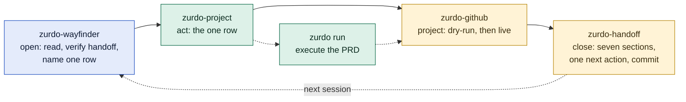

# Zurdo Skills Field Guide

Which of the four `project-management` skills to reach for, when, and what each one hands to the next. The [journey guide](zurdo-github-journey.md) explains every station in depth; this page is the short version you read before a session and the story that shows the skills used properly.

## The four skills in one line each

| Skill | Job | Reach for it when | Never use it to | Hands off to |
|---|---|---|---|---|
| `zurdo-wayfinder` | Read everything, change nothing, name one next action | You open a session on an initiative that already exists, or someone asks "where does this stand?" | Take the action it names, edit `scope.md`, or run a script mode | `zurdo-project` (any row), `zurdo-prd-author`, `zurdo-hint-debugger`, `zurdo-prd-review`, or the user |
| `zurdo-project` | Own the initiative: scope, tickets, phases, the priority table, the phase review | An idea needs to become an initiative, or the wayfinder named a row for this session | Publish a lone PRD that has no initiative, or author a PRD's tasks yourself | `zurdo-prd-author` for the PRD, `zurdo-github` for every GitHub write, `zurdo` for the run |
| `zurdo-github` | Paint files onto GitHub and mirror run outcomes back | A file changed (`scope.md`, a ticket, a PRD) or a run settled, and GitHub must catch up | Decide what to publish, edit a file from GitHub state, or run while `zurdo run` holds a lock | Nothing; it is the last step of a `zurdo-project` action |
| `zurdo-handoff` | Write `docs/<initiative>/handoff.md` and commit it as the last act | The session is stopping: the row is done, a human is needed, a run or subagent is left unattended, the user says stop | Store a decision or a lesson that has a real home, or summarize a run | `zurdo-wayfinder` in the next session |

Two supporting groups sit around them. Zurdo's bundled skills do the specialised work inside a `zurdo-project` action: `zurdo-prd-author` writes the phase PRD, `zurdo-state-summary` and `zurdo-hint-debugger` read and debug a run, `zurdo-prd-review` judges whether a green run landed the intent. The `zurdo` CLI executes the PRD. Install the bundled skills with `zurdo skills install --all`.

## The shape of every session

Open with the reader, act with the conductor, project with the script, close with the baton. The only session that skips the wayfinder is the very first one, because there is nothing to read yet. The only session that skips the handoff is the one that closes the scope issue because the destination was reached.

## The rules that pick the skill

**Files are truth; GitHub is a projection; the handoff is a hint.** `scope.md`, the ticket files, the PRDs, and `.zurdo/*/prd.json` decide. `zurdo-github` renders them. `zurdo-handoff` records one session's claim about them. When any two disagree, the file wins, and `zurdo-wayfinder` says which one lost.

**One row per session.** `zurdo-project`'s priority table has ten rows. The wayfinder names one, `zurdo-project` does that one, and the handoff records which one comes next. A session that does two rows has skipped a handoff.

**Every GitHub write is a script mode, dry-run first.** Whether the write is a scope refresh, a ticket close, a publish, or a status sync, the path is `zurdo-github.sh <mode> --dry-run`, read the plan, then the live call. The only direct `gh` writes are claiming a ticket by assignment and closing the scope issue at the end.

**Stop before a human, before an AFK step, and at the end of a row.** A grilling question, a `zurdo review`, a `zurdo run` left running, a research subagent dispatched: each one is a handoff. The next session's wayfinder re-checks every In flight entry and every Waiting on a human line before trusting the handoff's next action.

**Grilling first.** An open grilling ticket is row 1 whenever the user is present, because it is the only branch nothing else can substitute for. The agent asks, waits, and records the answer verbatim. It never fills in the answer.

## A short story: three sessions on one initiative

The initiative is the one in `zurdo-project`'s own examples: a CLI that exports observability data to CSV and posts it to a webhook. Priya is the developer. Each session uses the skills the way they are meant to be used, and the story says why each choice was made.

### Session one: nothing to read, so build the map

Priya opens a session with "I want a CLI that exports our monitoring data to CSV and posts it to a webhook." There is no `docs/observability-export/scope.md`, so `zurdo-wayfinder` has nothing to read and stays out of it. This is an idea, not a PRD, so `zurdo-project` takes it rather than `zurdo-prd-author`.

The destination interview runs until "done" fits in two sentences seen from the outside. The breadth interview names two pieces. CSV export is clear, so phase-01 is `ready`. Webhook delivery has two open questions: retry policy, which a subagent can research, and the auth scheme, which only Priya can decide. `zurdo-project` writes one research ticket, one grilling ticket, and marks phase-02 `researching`. It does not guess at the auth answer and it does not slice the fog any finer.

Now GitHub needs to catch up, so `zurdo-github` runs its `scope` mode, dry-run first. Priya reads the plan: the repo line, two phase rows, the payload that becomes the board README. The live run creates the scope issue, sweeps both ticket files into sub-issues, creates the Projects v2 board, and links it to the repo. `zurdo-project` dispatches the research subagent and does not wait.

Phase-01 is `ready`, so `zurdo-project` invokes `zurdo-prd-author`, which grills every task until `✓ READY TO RUN`. The PRD, its trail, and one lesson file land in a single commit. That commit is the review gate. Then `zurdo-github` again: `bootstrap` for the labels, `publish --scope <n>` for the milestone, epic, and task issues, `board --project "Observability export"` so the tasks land on the same board the scope run created. Phase-01 flips to `running` in `scope.md` and one more `scope` run pushes the change.

The runbook's first-session stop has arrived: scoped, researched, one PRD published, `zurdo run` not started. `zurdo-handoff` writes seven sections. In flight names the research subagent and how to check its ticket. Next action is row 5, start `zurdo run`, with its precondition. The handoff is the last commit.

### Session two: unattended, so read first and do exactly one row

Priya started `zurdo run` before a day of meetings and kicked off the next session from their phone, not at the desk. The session opens with `zurdo-wayfinder`, and only that. It reads `scope.md`, the two tickets, the run's `prd.json`, git, and the handoff. The handoff is stale: `prd.json` moved after it was written. In flight is re-checked, and the research subagent has not finished; its ticket file still says `open`. The run tally is three passed, one pending review, one failed.

Now the row. The grilling ticket is open, but Priya is absent, so it goes under Waiting on a human rather than becoming row 1. No research ticket is resolved, so row 2 does not apply. Phase-01 is `running` with a finished run that has a failed task, so the report names row 7. Under Do not it lists `sync-status` while a lock exists, which it checked and found absent. Its last line names `zurdo-hint-debugger` as the actor.

`zurdo-project` takes the row. Following the runbook it runs `sync-status` first so GitHub shows the failure while the fix is in progress. The dry-run shows three closes, one `zurdo:pending-review` label, one `zurdo:failed` label with the hint quoted, and one epic edit setting the table's Status column. Priya's teammate, who only reads GitHub, sees the red label within the minute. Then `zurdo-hint-debugger` reads the iteration captures and finds the code, not the hint, is wrong. The fix is committed, `zurdo run --resume` passes the task, and a second `sync-status` closes it. That second sync appended a second `Zurdo run:` comment to every task issue it touched; the label swaps and the table refresh were idempotent, the comments were not.

Row 7 is done, so the session stops. `zurdo-handoff` writes: Done this session lists the two sync runs and the fix commit by hash; In flight names the research subagent and the command that checks its ticket; Waiting on a human carries the auth question with a recommendation and the `zurdo review` sign-off due on the `[manual]` criterion; Next action is row 1, with the precondition that the user is present. Watch out records the duplicate comment and points it at the runbook's cleanup command. Last commit.

### Session three: the human's turn

Priya is at the desk, so `zurdo-wayfinder` opens as always. The handoff is stale again, because the research subagent resolved its ticket overnight and committed the findings. The report re-checks In flight, marks the retry ticket resolved but not yet absorbed into `scope.md`, and names row 1 rather than row 2: Priya being present makes the open grilling ticket the first thing to do, and nothing else can substitute for them.

`zurdo-project` claims the ticket by assignment, the one direct `gh` write it is allowed, and puts the auth question to Priya with a recommendation. Priya picks bearer tokens from an environment variable. The agent records that verbatim under Findings, flips the ticket to resolved, and `zurdo-github` runs `ticket` to close the issue with the findings as a comment. A Decisions line lands in `scope.md`, and one `scope` run pushes it to the scope issue and the board README.

Row 1 is done. `zurdo-handoff` writes the stop with row 2 as the next action, because the resolved research ticket is still not in `scope.md`, and commits.

### The sessions after

The rhythm does not change. Session four opens with the wayfinder, does row 2, flips phase-02 to `ready`, refreshes `scope`, hands off. Session five does row 8 once Priya has signed off the manual criterion in `zurdo review`: a final `sync-status`, a `scope` refresh, then `zurdo-prd-review`, because green criteria are necessary and not sufficient. The verdict is landed as intended, and the handoff names row 10. Session six runs the three-round phase review interview, marks phase-01 `done`, and hands off with row 3: phase-02 is `ready` and has no PRD, which is `zurdo-prd-author`'s work.

Six sessions, one row each, and the same four skills in the same order every time. Nothing was decided on GitHub, nothing durable lived only in a handoff, and the one thing that went slightly wrong, a duplicated comment, was recorded where the next session would find it.

## Mistakes the story avoided

| Mistake | What it costs | The rule that prevents it |
|---|---|---|
| Opening a later session with `zurdo-project` and acting on the handoff's next action | The handoff was stale; the session syncs a run that has moved or authors a PRD for a phase that got blocked | Open with `zurdo-wayfinder`; it re-derives the row from the files |
| Running `sync-status` twice to "make sure" | One extra `Zurdo run:` comment on every task issue per extra run | Sync once per settled run; the runbook has the cleanup command if you slip |
| Editing an issue body or a board README to fix a typo | The next `scope` or `publish` run overwrites it | Fix the file, re-run the mode |
| Answering a grilling question from the agent's own judgment | A decision that was the user's is now buried as a fact | Grilling is HITL; the agent asks, waits, records verbatim |
| Ending a session with `zurdo run` in flight and no handoff | The next session finds a lock and no note of who started what | Stop point 3: hand off before leaving an AFK step running |
| Putting a lesson or a decision only in Watch out | It never reaches `lessons/` or `scope.md`, so no future PRD sees it | Nothing durable lives only in the handoff; name its home and move it first |
| Passing no `--project` to `board` | A second board appears under the Projects tab | Pass the initiative title `scope` used; the script never deletes the stray |

## Where to go deeper

- [zurdo-github-journey.md](zurdo-github-journey.md) — every station with commands, diagrams of the data model, the phase state machine, and the sync mapping, plus a week of stories.
- `skills/project-management/zurdo-project/references/runbook.md` — the ten-row priority table and the publish sequence.
- `skills/project-management/zurdo-wayfinder/references/situation-report.md` — fresh, stale, and no-handoff reports worked in full.
- `skills/project-management/zurdo-handoff/examples/handoff.md` — a complete handoff for this same initiative.
- `skills/project-management/zurdo-github/references/runbook.md` — auth, exit codes, the table-refresh warnings, and the comment cleanup.
